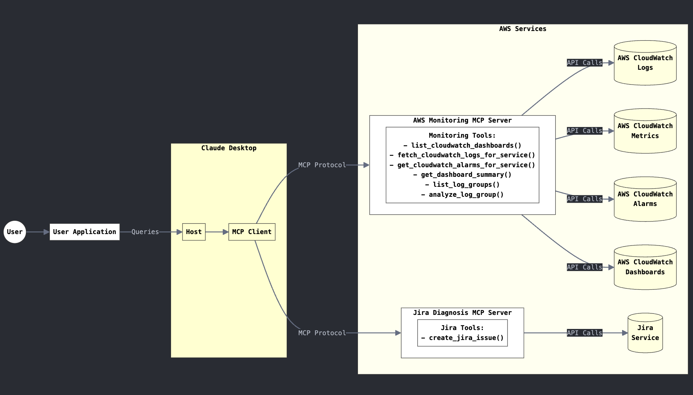
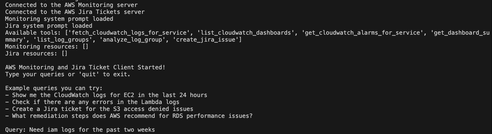

# AWS Incident Response with MCP Servers

#### 🚨 WHAT'S NEW 🚨
---
***CROSS-ACCOUNT MONITORING NOW AVAILABLE!***

> **New Feature Alert**: You can now monitor and create Jira tickets for resources across multiple AWS accounts! Simply provide your account ID and role name with cross-account access permissions once prompted by the host LLM, and the monitoring MCP server will assume that role to fetch data from other accounts.
>
> **How it works**:
> 1. Specify that you want to use cross-account access
> 2. Provide the target AWS account ID (12-digit number)
> 3. Provide the IAM role name with necessary permissions
> 4. The system automatically handles role assumption and data retrieval
>
> This enhancement allows centralized monitoring and incident management across your AWS organization! Build centralized dashboards, custom analysis and more, all through Natural Language.

An intelligent AWS monitoring and incident response solution using `Anthropic's Model Context Protocol` (MCP). This solution empowers users to monitors AWS resources, analyzes CloudWatch logs and metrics for various services (Amazon Bedrock, EC2, IAM, CloudTrail, VPC, RDS, etc), identifies trends, patterns and issues, and creates comprehensive Jira tickets with remediation steps. This eliminates hours of manual analysis and sifting through dashboards and log chunks by interacting with your MCP system in real time in natural language.

#### YouTube demo: https://www.youtube.com/watch?v=BNoEMFc2Rv4



## What is Model Context Protocol (MCP)?

MCP provides a standardized way to connect AI models to virtually any data source or tool. Using a client-server architecture, MCP enables developers to expose their data through lightweight MCP servers while building AI applications as MCP clients that connect to these servers. Through this architecture, MCP enables users to build more powerful, context-aware AI agents that can seamlessly access the information and tools they need.

## Overview
This tool provides an intelligent interface to AWS CloudWatch logs, metrics, and alarms using Anthropic's Claude model. It functions as a multi-MCP server solution that can:

1. Monitor AWS Services: Analyze CloudWatch logs and metrics for various AWS services

1. Detect Issues: Identify patterns, errors, and anomalies in your AWS environment

1. Create Jira Tickets: Automatically generate well-structured Jira tickets with detailed information

1. Recommend Solutions: Include remediation steps in tickets based on AWS best practices

## Features

1. **Multi-Server Architecture**: Separate MCP servers for monitoring and ticketing

1. **Natural Language Interface**: Interact with your AWS environment using plain English

1. **Comprehensive AWS Service Coverage**: Monitor EC2, Lambda, RDS, Bedrock, S3, and more

1. **Intelligent Analysis**: Detect patterns and anomalies in logs and metrics

1. **Automatic Jira Integration**: Create detailed tickets with proper formatting

1. **Solution Recommendations**: Tickets include AWS-recommended remediation steps

### Requirements

- Python 3.12
- AWS credentials with CloudWatch access
- Jira account with API access
- Anthropic API access (for Claude integration)
- Claude Desktop (optional)

```
## Solution structure
MCP_AWS_Incident_Response/
├── README.md
├── client.py
├── globals.py
├── main.py
├── pyproject.toml
├── server_scripts/
│   ├── monitoring_agent_server.py
│   └── diagnosis_agent_server.py
└── uv.lock
```

## Installation

1. Install uv (Python package manager):

    ```bash
        # On macOS and Linux
        curl -LsSf https://astral.sh/uv/install.sh | sh

        # On Windows
        powershell -ExecutionPolicy ByPass -c "irm https://astral.sh/uv/install.ps1 | iex"
    ```

1. Clone this repository:

    ```bash
        git clone https://github.com/madhurprash/AWS_CloudGuardMCP.git
        cd AWS_CloudGuardMCP
    ```

1. Set up the Python virtual environment and install dependencies:

    ```bash
        uv venv --python 3.12
        source .venv/bin/activate  # On Windows: .venv\Scripts\activate
        uv pip install --requirement pyproject.toml
    ```

1. Configure your AWS credentials if not done already:

    ```bash
        mkdir -p ~/.aws
        # Set up your credentials in ~/.aws/credentials and ~/.aws/config
    ```

## Usage

1. Export the environment variables:

  ```bash
  export JIRA_API_TOKEN="<your-jira-api-token" && export JIRA_USERNAME="<your-jira-username>" && export JIRA_INSTANCE_URL="<your-jira-instance-url>" && export JIRA_CLOUD="True" && export PROJECT_KEY="<jira-project-key>" && echo "Jira environment variables exported successfully"
  ```

1. Running with the Client: The simplest way to use the solution is through the provided client:

    ```bash
        # this is the MCP client, connects to the servers, lists the available tools
        # and allows a ReACT agent to be run and interact with the server tools based
        # on the user query
        uv run client.py --model-id=<bedrock-model>
    ```

    

- ***This will start an interactive chat interface where you can***:
    - Ask about AWS logs and metrics
    - Request analysis of specific services
    - Create Jira tickets for identified issues

## Configuration with Claude Desktop
You can also use this solution directly with Claude Desktop by adding the following to your Claude Desktop configuration file:

```json
{
  "mcpServers": {
    "aws_monitoring": {
      "command": "/path/to/your/venv/bin/python3 [this is in your virutal environment built from the `uv` commands above]",
      "args": [
        "/path/to/your/repo/server_scripts/monitoring_agent_server.py"
      ],
      "env": {
        "AWS_ACCESS_KEY_ID": "YOUR_ACCESS_KEY_ID",
        "AWS_SECRET_ACCESS_KEY": "YOUR_SECRET_ACCESS_KEY",
        "AWS_REGION": "<your-aws-region>",
        "BEDROCK_LOG_GROUP": "<your-bedrock-log-group> [optional]",
        "MCP_TRANSPORT": "stdio"
      }
    },
    "jira_server": {
      "command": "/path/to/your/venv/bin/python3 [this is in your virutal environment built from the `uv` commands above]",
      "args": [
        "/path/to/your/repo/server_scripts/diagnosis_agent_server.py"
      ],
      "env": {
        "JIRA_API_TOKEN": "YOUR_JIRA_API_TOKEN",
        "JIRA_USERNAME": "your.username@example.com",
        "JIRA_INSTANCE_URL": "https://your-instance.atlassian.net",
        "JIRA_CLOUD": "True",
        "PROJECT_KEY": "YOUR_PROJECT_KEY",
        "MCP_TRANSPORT": "stdio"
      }
    }
  }
}
```

#### The configuration file path depends on your operating system:

1. `macOS`: `~/Library/Application Support/Claude/claude_desktop_config.json`
1. `Windows`: `%APPDATA%\Claude\claude_desktop_config.json`
1. `Linux`: `~/.config/Claude/claude_desktop_config.json`

## Available Tools

### Monitoring Server Tools

| Tool | Description |
|------|-------------|
| `list_cloudwatch_dashboards()` | Lists all CloudWatch dashboards in your AWS account |
| `fetch_cloudwatch_logs_for_service(service_name, days, filter_pattern)` | Retrieves CloudWatch logs for a specified service |
| `get_cloudwatch_alarms_for_service(service_name)` | Fetches CloudWatch alarms for a specific service |
| `get_dashboard_summary(dashboard_name)` | Retrieves and summarizes the configuration of a dashboard |
| `list_log_groups(prefix)` | Lists all CloudWatch log groups, optionally filtered by prefix |
| `analyze_log_group(log_group_name, days, max_events, filter_pattern)` | Analyzes a specific CloudWatch log group for insights |

### Jira Server Tools

| Tool | Description |
|------|-------------|
| `create_jira_issue(summary, description)` | Creates a new issue in Jira with the specified details |

## Supported AWS Services

This solution supports monitoring and analysis of the following AWS services:

- **EC2/Compute Instances** [ec2]
- **Lambda Functions** [lambda]
- **RDS Databases** [rds]
- **CloudTrail** [cloudtrail]
- **S3 Storage** [s3]
- **VPC Networking** [vpc]
- **WAF Web Security** [waf]
- **Bedrock** [bedrock/generative AI]
- **IAM Logs** [iam]

## Example Queries

Once connected through the client or Claude Desktop, you can ask questions like:

- "Show me the CloudWatch logs for EC2 in the last 24 hours"
- "Are there any errors in the Lambda logs?"
- "List all active CloudWatch alarms"
- "Create a Jira ticket for the EC2 memory utilization issue"
- "What remediation steps does AWS recommend for RDS performance issues?"

## Workflow

1. **Monitoring Phase**:
   - Request logs and metrics for specific AWS services
   - Analyze data for patterns, errors, and anomalies
   - Identify potential issues requiring attention

2. **Diagnosis Phase**:
   - Investigate identified issues in depth
   - Determine root causes and impact
   - Search for AWS-recommended remediation steps

3. **Ticketing Phase**:
   - Create detailed Jira tickets with all necessary information
   - Include evidence, impact assessment, and remediation steps
   - Track issues through to resolution

## Security Considerations

- Store your AWS credentials and Jira API tokens securely
- Never commit credentials to version control
- Use IAM roles with minimum required permissions
- Consider using AWS Secrets Manager for credential management

## Development

To extend the functionality:

1. Add new monitoring tools to `monitoring_agent_server.py`
2. Add new diagnostic tools to `diagnosis_agent_server.py`
3. Update the client to utilize new features


