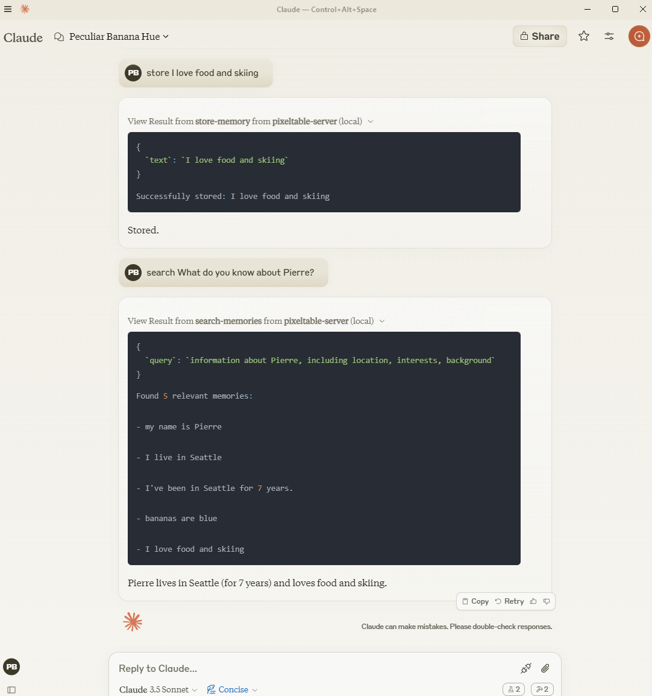
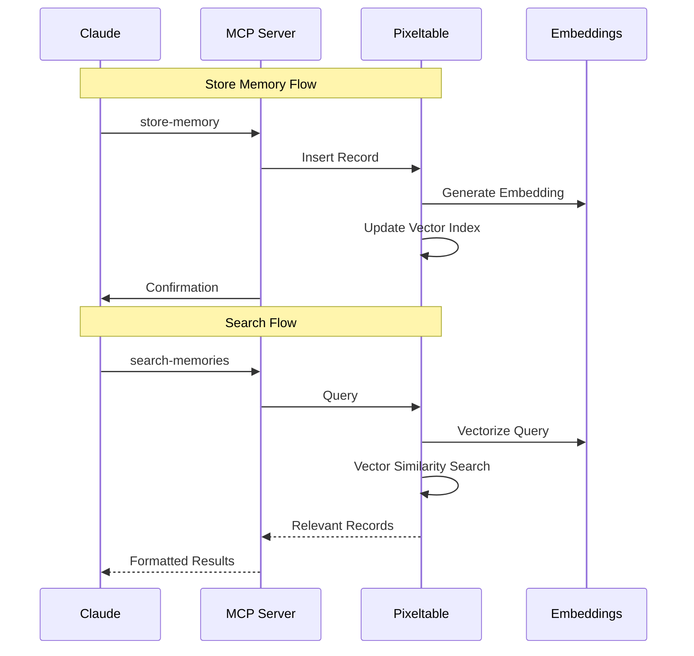

# Pixeltable MCP Server

 This server provides access to [Pixeltable](https://github.com/pixeltable/pixeltable), an Open Source AI Data Infrastructure.

 
## Overview
This MCP server leverages Pixeltable's multimodal capabilities for semantic memory. While currently focused on text due to Claude Desktop UI limitations, Pixeltable supports:

- Text, images, video, audio, JSON, arrays...
- Integration with external AI services (e.g. llama.cpp...)
- External API orchestration through UDFs
- Vector search across all modalities using custom embeddings

The current implementation provides:

- Semantic text search and storage
- Auto-indexing and retrieval
- Versioned data history

## Tools

### store-memory
```python
{
    "text": "string",  # Information to store
}
```

### search-memories
```python
{
    "query": "string",      # Search query
    "limit": int,          # Max results (default: 5)
}
```

## Implementation Details

### Memory Storage
```python
# Insertion with timestamp
table.insert([{
    'text': memory_text,
    'timestamp': datetime.now()
}])
```

### Vector Search
```python
# Similarity lookup
sim = table.text.similarity(query)
results = (
    table
    .order_by(sim, asc=False)
    .select(table.text)
    .limit(limit)
    .collect()
)
```
## Configuration

Add to `claude_desktop_config.json`:
```json
{
	"mcpServers": {
	  "pixeltable-server": {
		"command": "python",
		"args": ["-m", "mcp_server_pixeltable.server"],
		"env": {
		  "PYTHONPATH": "<your-path>/pixeltable/src"
		}
	  }
	}
  }
```
## Technical Architecture


## Development

### Requirements
- Python ≥3.10
- pixeltable ≥0.2.26
- mcp ≥0.9.1
- transformers ≥4.46.3
- sentence-transformers ≥3.3.1

### Local Setup
```bash
git clone https://github.com/modelcontextprotocol/servers.git
cd servers/src/pixeltable

# Using pip
pip install -e .

# OR using uv (faster)
uv pip install -e .

python -m mcp_server_pixeltable.server
```

## License
This MCP server is licensed under the MIT License. This means you are free to use, modify, and distribute the software, subject to the terms and conditions of the MIT License. For more details, please see the LICENSE file in the project repository.
